<div align="center">
  
  <br>
  <h1>ViewRAG</h1>
  
  [ [中文](README.md) | English ]
</div>

---

**ViewRAG** is a RAG (Retrieval-Augmented Generation) system focused on **intelligent PDF parsing and illustrated Q&A**.

The **core value** of the project lies in breaking the text-only limitation of traditional RAG by leveraging the deep understanding capabilities of Large Language Models (LLMs) to achieve **precise recall of images and tables** within documents. By combining MinIO object storage with carefully designed Prompts, the system guides the LLM to naturally interleave images in its responses, avoiding issues with long image URLs. Furthermore, the system synchronizes reference sources back to the frontend, enabling **real-time image rendering and strict PDF citation tracing**, effectively solving the trust issue associated with LLM answers.

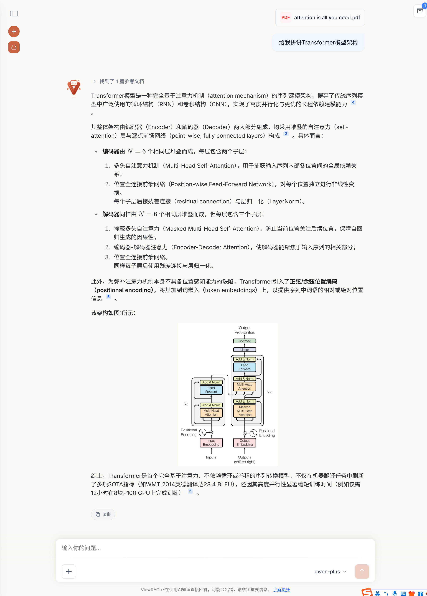

## 🌟 Core Highlights

- **Illustrated Q&A Experience**: The LLM can inline reference images in its answers, which are rendered in real-time on the frontend, providing a rich experience similar to reading the original document.
- **Precise Citation Tracing**: Answers automatically include citation numbers. The frontend displays the corresponding document page numbers, snippets, and image previews. Clicking highlights the location in the embedded PDF, resolving LLM trust issues.
- **Layout-Aware Smart Chunking**: Abandoning traditional fixed-length/recursive chunking that destroys information continuity. It fully utilizes PDF parsing results to preserve original paragraph structures, automatically merging headers with body text, and intelligently stitching small chunks (block size 1024), balancing semantic integrity and retrieval precision.
- **Deep Understanding of Charts**: For images and tables in PDFs, Vision LLMs and text generation models are called to generate structured semantic descriptions, which are converted into vectors for subsequent recall, significantly improving the retrieval hit rate for chart contents.
- **Comprehensive Model Support**: Supports flexible model selection and switching, fully compatible with **text generation models, multimodal models, and reasoning models**.
- **Ultimate Interactive Experience**: Supports editing questions and regenerating from any dialogue node; real-time SSE progress push for document processing.

## 📸 Interface Preview

| Model Selection (Text/Multimodal/Reasoning)    | Main Chat Interface                          |
| ---------------------------------------------- | -------------------------------------------- |
| 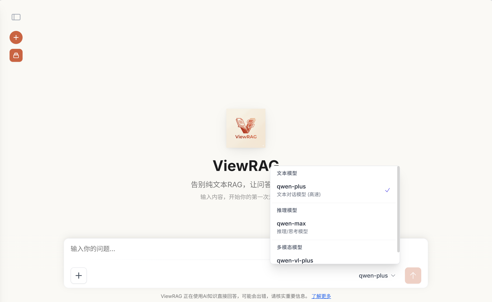 | 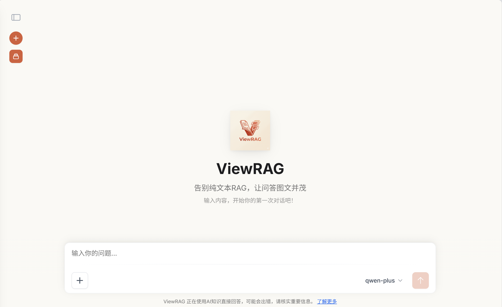 |

| Citation Tracing (Solving Trust Issues)      | PDF Highlight Tracing                             |
| -------------------------------------------- | ------------------------------------------------- |
| 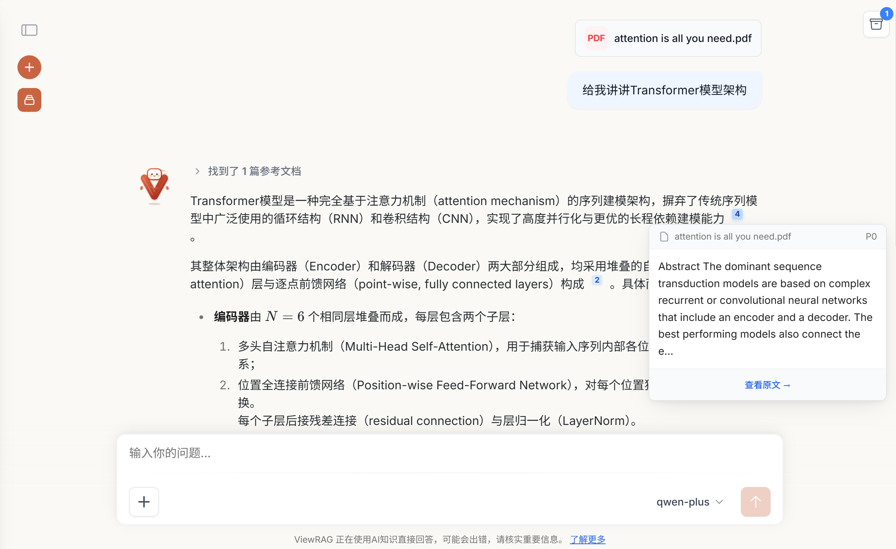 | 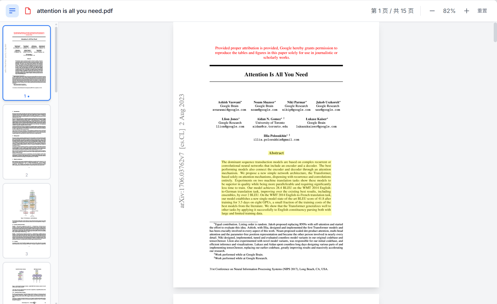 |

| PDF Layout Analysis                           | Layout-Based Smart Chunking (Note: IDs indicate same chunk) |
| --------------------------------------------- | ----------------------------------------------------------- |
| 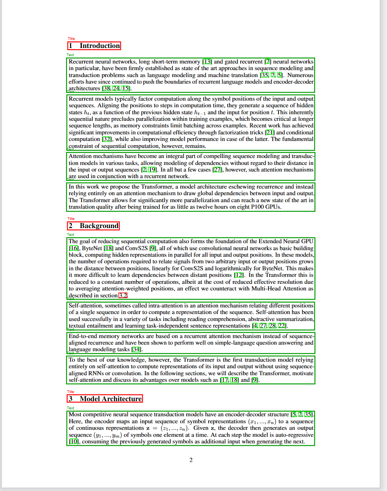 | 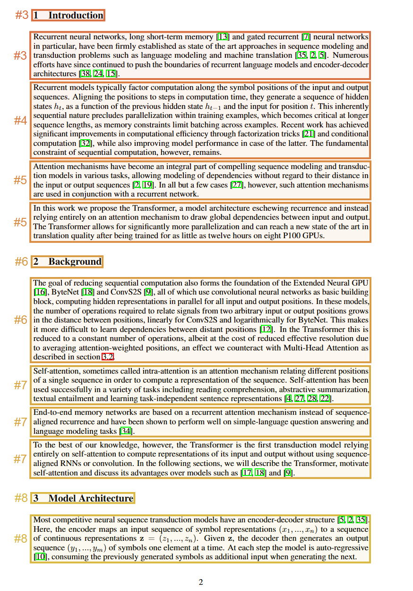               |

| Deep Reasoning (Reasoning)                     | Visual Understanding (Vision Language)     |
| ---------------------------------------------- | ------------------------------------------ |
| 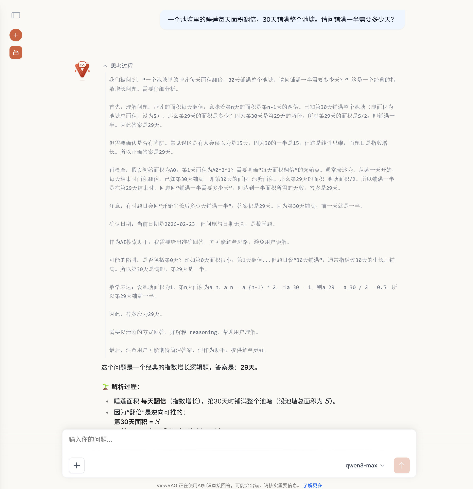 | 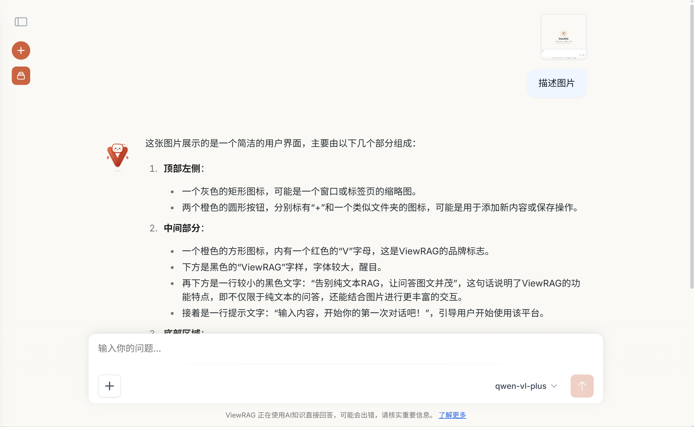 |

| Edit & Regenerate at Any Node                | Knowledge Base Management                  |
| -------------------------------------------- | ------------------------------------------ |
| 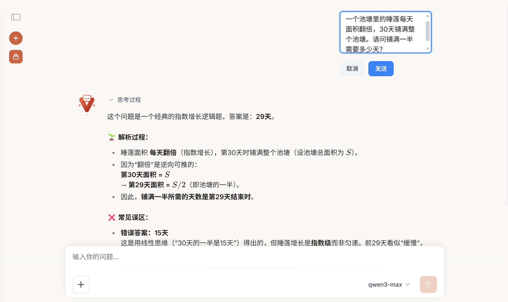 | 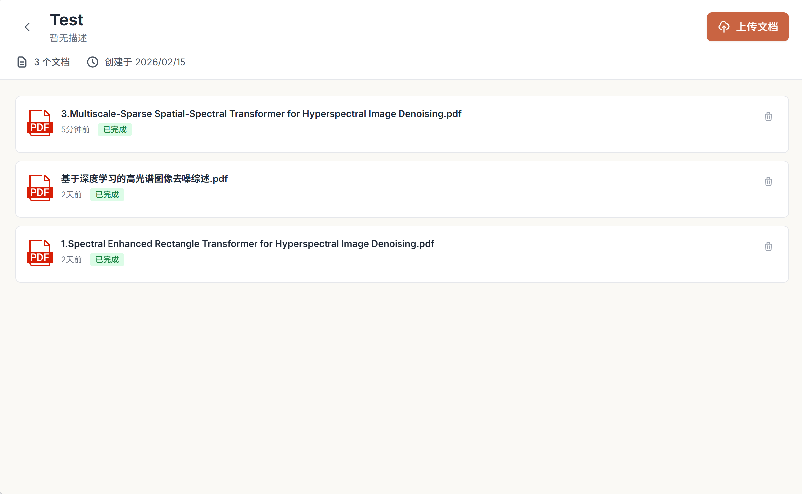 |

## ⚙️ Core Features

- **High-Quality PDF Parsing**: Integrates with PaddleX Layout Analysis API to identify layout elements such as text, titles, images, tables, and formulas, and accurately extract bbox coordinates.
- **Vector Retrieval**: Semantic vector retrieval based on pgvector, supporting precise filtering by session/knowledge base scope.
- **Query Rewriting**: Automatically completes pronouns based on dialogue history to improve retrieval accuracy in multi-turn dialogues.
- **Knowledge Base Management**: Supports creating permanent knowledge bases and uploading multiple PDFs for unified retrieval.
- **Session Documents**: Supports temporary PDF uploads within a dialogue, searchable only within the current session.
- **Multi-User / Multi-Session**: Independent account system with isolated sessions and knowledge bases for each user.
- **Any LLM Compatibility**: All models are accessed via OpenAI-compatible APIs, supporting Qwen, DeepSeek, GLM, Ollama, etc.

## System Architecture

```
┌─────────────────────────────────────────────────────────┐
│                       Nginx (8080)                       │
│      Reverse Proxy + SSE No-Buffering + Large File Upload │
└────────────────┬──────────────────┬─────────────────────┘
                 │                  │
        ┌────────▼──────┐   ┌───────▼────────┐
        │  Frontend      │   │  Backend        │
        │  Vue3 + Vite   │   │  FastAPI        │
        │  Nginx Static  │   │  Python 3.10    │
        └───────────────┘   └───────┬─────────┘
                                    │
              ┌─────────────────────┼──────────────────────┐
              │                     │                       │
     ┌────────▼────────┐  ┌─────────▼──────┐  ┌───────────▼───────┐
     │  PostgreSQL      │  │    MinIO        │  │  PaddleX API      │
     │  + pgvector      │  │  Files / Images │  │  PDF Layout       │
     │  Vector + Meta   │  │  Object Storage │  │  Analysis         │
     └─────────────────┘  └────────────────┘  └───────────────────┘
```

**PDF Processing Pipeline:**

```
Upload PDF
  → PaddleX API Layout Analysis (Identify Text/Image/Table/Formula Blocks)
  → PyMuPDF Crop Images by bbox → Upload to MinIO
  → Block Chunker (Text Merge / Chart Independent)
  → Vision LLM Image Description / LLM Table Summary (KB Mode)
  → Embedding Vectorization → Save to pgvector
```

**RAG Retrieval Pipeline:**

```
User Query
  → QueryRewrite
  → Embedding Query Vectorization
  → pgvector Similarity Search (Filter by kb_id / session_id)
  → ContextBuilder Build Context + Assign Citation IDs
  → REFERENCE_SYSTEM_PROMPT Inject Citation Rules
  → LLM Stream Generation (SSE Push)
  → Frontend Parse image:ImageN Render Image + [N] Render Badge
```

## Quick Deployment

### Environment Requirements

- **Docker** ≥ 20.10
- **Docker Compose** ≥ v2.0

### 1. Clone Project

```bash
git clone https://github.com/David-Lolly/ViewRAG.git
cd ViewRAG
```

### 2. Start Services

```bash
cd docker
docker compose build
docker compose up -d
```

First run will automatically build images, wait about 3~5 minutes.

### 3. Access Application

```
http://localhost:8080
```

### 4. Complete Model Configuration

After logging in for the first time, go to the **Configuration Page**. You can select a provider to quickly complete the configuration or manually fill in model information (all support OpenAI-compatible APIs):

| Configuration Item          | Usage                             | Recommended Models       |
| --------------------------- | --------------------------------- | ------------------------ |
| **Chat Model (Text)**       | Daily Chat / RAG QA               | qwen-plus, deepseek-chat |
| **Chat Model (Multimodal)** | Chat with Images                  | qwen-vl-plus             |
| **Vision Model**            | PDF Image Understanding           | qwen-vl-flash            |
| **Summary Model**           | Doc Summary / Table Understanding | qwen-flash               |
| **Embedding Model**         | Text Vectorization                | text-embedding-v4        |
| **Rerank Model**            | Result Re-ranking                 | gte-rerank-v2            |
| **PaddleX API**             | PDF Layout Analysis (Required)    | See below                |

> **Get PaddleX API**: Go to [AI Studio](https://aistudio.baidu.com/paddleocr) to get the PaddleX Layout Analysis service, fill `api_url` and `api_token` into the configuration page.
>
> **Recommended Providers**: [Aliyun Bailian](https://bailian.console.aliyun.com/) (Qwen series), [SiliconFlow](https://cloud.siliconflow.cn/) (Free tier available), and any provider compatible with OpenAI API.

After configuration, click the **Test Connection** button for each item. Once all pass, save to start using.

---

### Source Code Deployment (For Developers)

Requires self-deployment of PostgreSQL (with pgvector extension) and MinIO, and filling in connection info in `backend/.env`.

**Backend:**

```bash
conda create -n viewrag python=3.10
conda activate viewrag
cd backend
pip install -r requirements.txt -i https://pypi.tuna.tsinghua.edu.cn/simple
python main.py
```

**Frontend:**

```bash
cd frontend
npm install
npm run dev
```

## Project Structure

```
ViewRAG/
├── docker/                      # Docker deployment config
│   ├── mount                    # Container mounts   
│   ├── docker-compose.yaml      # Service orchestration (postgres + minio + backend + frontend + nginx)
│   └── .env.docker              # Env vars (DB, MinIO accounts)
├── nginx.conf                   # Nginx reverse proxy config (inc. SSE no-buffering rules)
│
├── backend/                     # FastAPI Backend
│   ├── main.py                  # App entry, route registration
│   ├── config.yaml              # Model config (LLM / Embedding / Rerank / OCR)
│   ├── routers/                 # API Routes
│   │   ├── llm.py               # Chat send, RAG retrieval, stream output
│   │   ├── documents.py         # Document processing SSE, PDF stream download
│   │   ├── knowledge_base.py    # Knowledge Base CRUD
│   │   └── ...
│   ├── services/
│   │   ├── OcrAndChunk/         # PDF Parsing & Chunking Core
│   │   │   ├── paddle_ocr/      # PaddleX Parser (client / converter / parser)
│   │   │   ├── chunk/           # Chunking Strategy (block_chunker / recursive_chunker)
│   │   │   ├── image_extractor.py  # PyMuPDF Image Cropping + MinIO Upload
│   │   │   └── factory.py       # OCR Parser Factory
│   │   ├── document/
│   │   │   ├── enhancement_service.py  # LLM Image Description / Table Summary
│   │   │   └── vector_service.py       # Embedding Vectorization
│   │   ├── chat/
│   │   │   ├── context_builder.py  # Search Results → LLM Context + Citation IDs
│   │   │   ├── query_rewrite.py    # Multi-turn Query Rewriting
│   │   │   └── prompts.py          # Citation Rules System Prompts
│   │   ├── retrieval_service.py    # Unified Vector Retrieval Entry
│   │   ├── chat_service.py         # Message Construction (Multimodal/Text)
│   │   └── llm_service.py          # LLM Stream Call
│   ├── models/models.py            # ORM Models (User / Session / Document / Chunk)
│   └── crud/                       # Database CRUD
│
└── frontend/                    # Vue 3 Frontend
    ├── src/views/               # Page Components
    │   ├── ChatView.vue         # Main Chat Page
    │   ├── KnowledgeBaseList.vue / KnowledgeBaseDetail.vue
    │   ├── PDFViewerPage.vue    # PDF Embedded Preview (PDF.js)
    │   └── ConfigView.vue       # Model Config Page
    └── src/components/          # Reusable Components
        ├── chat/                # Message Rendering (inc. Image Citation, Badges)
        ├── DocumentUpload.vue   # Document Upload + Real-time Progress
        └── pdf/                 # PDF Viewer Component
```

## Future Plans
- Implement AgenticRAG for intelligent retrieval
- Support local PDF parsing, removing dependency on PaddleOCR API calls
- Develop OCR service interface to provide OCR parsing services for Bisheng

## Contribution

Issues and Pull Requests are welcome!


